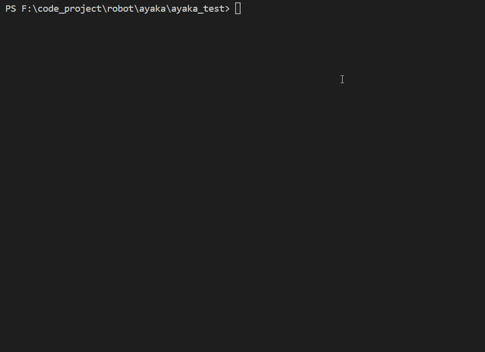

# Ayaka - 文字游戏开发辅助插件

适用于[nonebot2机器人](https://github.com/nonebot/nonebot2)的文字游戏开发辅助插件 


ayaka 二次封装nonebot2提供的api，提供了专用api

从而为其他文字游戏插件（衍生插件）的编写提供支持

单独安装本插件没有意义，本插件的意义在于帮助衍生插件实现功能

## 特点展示

### 状态控制

<div id="fake-qq">
    <div>
        <div class="screen">
            <div class="message">FAKE QQ</div>
            <div class="message">- 仅用于展示，并非真的使用js实现了python代码</div>
            <div class="message">- 安装了hello world插件的bot，其效果与此一致</div>
        </div>
        <input placeholder="#">
    </div>
    <div class="command-list"></div>
</div>


### 测试套件




### 自动合成帮助

``` py
from ayaka import AyakaApp
app = AyakaApp("测试")
app.help = "测试一下"

@app.on_command(["t","test"])
async def handle():
    '''发送成功啦'''
    await app.send("成功啦")
```


## 相关链接

### 本体仓库

[插件仓库](https://github.com/bridgeL/nonebot-plugin-ayaka)

[文档仓库](https://github.com/bridgeL/ayaka_doc) 

### 衍生插件仓库

[示例库](https://github.com/bridgeL/ayaka_plugins)

[小游戏合集](https://github.com/bridgeL/nonebot-plugin-ayaka-games)

## 下一步

<div align="right">
    在这里~ ↘
</div>
