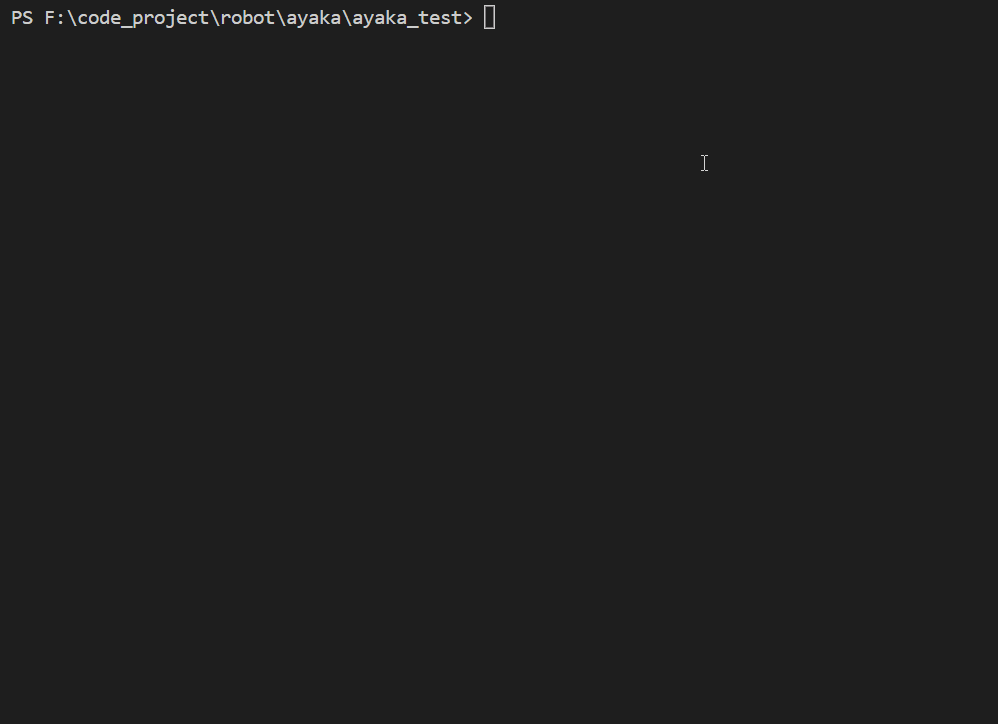

# 测试ayaka衍生插件

开发结束后自然是测试啦

ayaka_test模拟了一个不需要连接真实qq账号的假cqhttp

目前的假cqhttp只提供了

- send_msg
- send_group_msg
- send_group_forward_msg
- send_private_msg
- get_group_member_list
- get_friend_list
- ...

其他功能可以自行编写代码对ayaka_test进行增强！

已给出两个钩子函数供拓展使用

## 效果

测试插件为 [谁是卧底](https://github.com/bridgeL/nonebot-plugin-ayaka-who-is-suspect)



退出时直接 CTRL+C

## 使用方法

下载本套件 `git clone https://github.com/bridgeL/nonebot-plugin-ayaka`

将待测试的ayaka衍生插件放入plugins目录下

安装依赖 `pip install -r requirements.txt`

运行入口 `python bot.py`

## 通用命令

| 命令                            | 功能                                      |
| ------------------------------- | ----------------------------------------- |
| g `<group_id> <user_id> <text>` | 伪造一条群聊消息                          |
| p `<user_id> <text> `           | 伪造一条私聊消息                          |
| d 1                             | 延时1秒                                   |
| dn 0.1                          | 延时0.1秒后空一行                         |
| sa on/off                       | 打开/关闭 对nonebot收发消息的采样         |
| s -n test                       | 执行script/test.ini自动化脚本             |
| s -p yes -n test                | 执行plugins/yes/script/test.ini自动化脚本 |

- `-p` plugin_name
- `-n` name

## 自动化脚本

### 额外命令

| 命令           | 功能                             |
| -------------- | -------------------------------- |
| hide           | 关闭命令回显                     |
| before `<cmd>` | 每一条命令执行前需额外执行的命令 |
| after `<cmd>`  | 每一条命令执行后需额外执行的命令 |
| ;              | 注释（必须放在每一行的开头）     |
| #              | 注释（必须放在每一行的开头）     |

### 脚本示例

```
hide 

# 用于区分不同对话段
after dn 0.1

g 100 1 星际旅行
g 100 1 hi
g 100 1 goto 月球
g 100 1 jump
```

## 如何增强ayaka_test

虽然名义上是ayaka衍生插件的测试套件，然而其与ayaka没多少关系，可以直接拿去当nonebot插件的测试套件

<del>不过，由于只模仿了几条功能，因此更多的还是适用于文字游戏插件的测试</del>

在ayaka_test中，分别给出了两个钩子函数

- `fake_qq.on_terminal` 编写自定义的终端命令
- `fake_qq.on_cqhttp` 编写自定义的假cqhttp的api

具体编写可分别参考`ayaka_test/terminal.py`和`ayaka_test/cqhttp.py`文件

## win10 fastapi reload卡死问题

测试套件可能会在特定情况下卡死，无法结束进程，从而占用测试端口

win10可尝试运行`python clean.py`清理卡死的进程

## 下一步

<div align="right">
    在这里~ ↘
</div>

