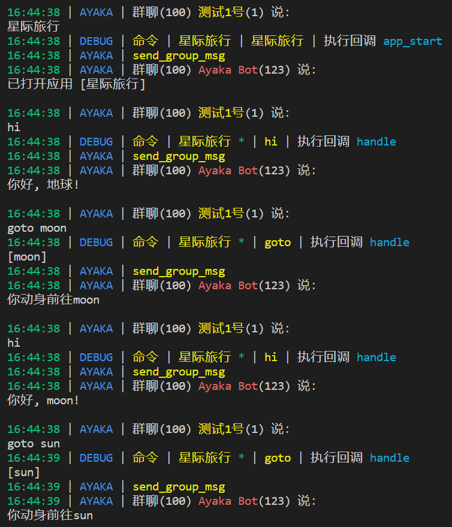
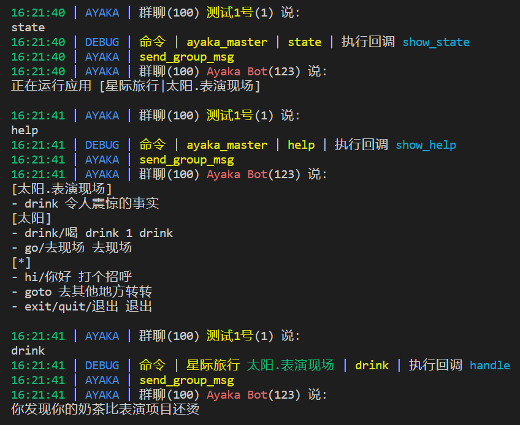
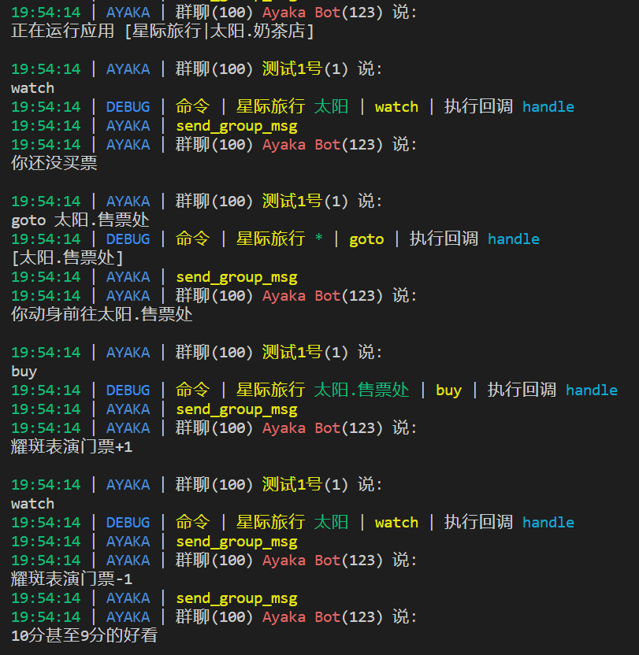
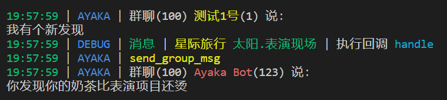
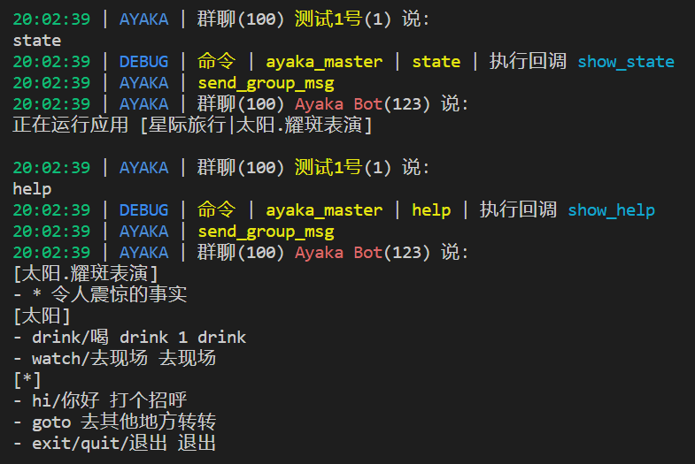

# 快速开始

`ayaka`希望帮助开发者更轻松地控制应用状态，并避免不同插件间的命令重名导致的冲突问题

## 命令隔离

ayaka将每一个`插件`都视为一个`应用`，每一个`群聊`视为一个`设备`

设备平时处于`闲置状态`，你可以通过命令打开一个应用，令其运行

随后，该设备将 **只响应** 该应用相关的命令

例如：插件A（应用A）和插件B（应用B）都使用了一个`查询`的命令，那么设备将响应哪一个呢？

ayaka的解决方式是，你需要先运行`应用A`和`应用B`中的一个，之后才可以使用`查询`命令，正在运行的应用进行响应

## 状态机

假设我们现在需要做一个`星际旅行`的小游戏插件：你在不同的星球（状态）可以干不同的事，产生不同的后果

### 需求如下

| 地点     | 动作        | 效果                     |
| -------- | ----------- | ------------------------ |
| 地球     | jump        | 一跳两米高               |
| 地球     | hit         | 你全力一击，制造了大地震 |
| 月球     | jump        | 你离开了月球...永远的... |
| 太阳     | drink       | 嘿！像是一团火球进了胃   |
| 任意地点 | goto <名字> | 去另一个星球             |
| 任意地点 | hi          | 你好, <名字>!            |

### 编写代码

```py
from ayaka import AyakaApp

app = AyakaApp("星际旅行")
app.help = "xing ji lv xing"


# 启动应用
@app.on.idle()
@app.on.command("星际旅行")
async def app_start():
    '''打开应用'''
    # 设置初始状态为地球
    await app.start("地球")


# 星球
earth = app.on.state("地球")
moon = app.on.state("月球", "月亮")
sun = app.on.state("太阳")
all = app.on.state("*")

# 动作
hi = app.on.command("hi", "你好")
hit = app.on.command("hit", "打")
jump = app.on.command("jump", "跳")
drink = app.on.command("drink", "喝")


@all
@hi
async def handle():
    '''打个招呼'''
    await app.send(f"你好, {app.state}!")


@earth
@jump
async def handle():
    '''跳一跳'''
    await app.send("一跳两米高")


@earth
@hit
async def handle():
    '''打一打'''
    await app.send("你全力一击，制造了大地震")


@moon
@jump
async def handle():
    '''跳一跳'''
    await app.send("你离开了月球...永远的...")


@sun
@drink
async def handle():
    '''drink 1 drink'''
    await app.send("嘿！像是一团火球进了胃")


@all
@app.on.command("goto")
async def handle():
    '''去其他地方转转'''
    name = str(app.arg)
    app.state = name
    await app.send(f"你动身前往{name}")
```

这样就完成了

```py
# 关闭应用
@all
@app.on.command("exit", "quit", "退出")
async def handle():
    '''退出'''
    await app.close()
```

哦，不要忘记编写退出命令！



## 多层次的状态

在刚才的基础上，我们希望能再加点功能，比如，太阳上新开了一家奶茶店

### 需求如下

| 地点          | 动作  | 效果                   |
| ------------- | ----- | ---------------------- |
| 太阳.奶茶店   | drink | 喝了一口3000度的奶茶   |
| 太阳.其他地点 | drink | 嘿！像是一团火球进了胃 |

### 编写代码

```py
# 补充1
@app.on.state("太阳.奶茶店")
@drink
async def handle():
    '''热乎的'''
    await app.send("喝了一口3000度的奶茶")
```



## 缓存

宇宙旅游公司又开设了一个新景点：耀斑表演

我们需要先去售票处买耀斑表演的门票，然后再去表演现场

### 需求如下

| 地点          | 动作  | 效果           |
| ------------- | ----- | -------------- |
| 太阳.售票处   | buy   | 耀斑表演门票+1 |
| 太阳.任意地点 | watch | 去表演现场     |

### 编写代码

```py
# 补充2
@app.on.state("太阳.售票处")
@app.on.command("buy")
async def handle():
    '''买门票'''
    ctrl = app.cache.chain("ticket")
    ctrl.set(ctrl.get(0) + 1)
    await app.send("耀斑表演门票+1")


@app.on.state("太阳")
@app.on.command("watch", "去现场")
async def handle():
    '''去现场'''
    ctrl = app.cache.chain("ticket")
    ticket = ctrl.get(0)
    if ticket > 0:
        ctrl.set(ticket - 1)
        await app.send("耀斑表演门票-1")
        app.state = "太阳.耀斑表演"
        await app.send("10分甚至9分的好看")
    else:
        await app.send("你还没买票")
```



## 消息触发

除了命令触发以外，消息触发也可以，比如，你在现场随便说了一句话

```py
# 补充3
@app.on.state("太阳.耀斑表演")
@app.on.text()
async def handle():
    '''令人震惊的事实'''
    await app.send("你发现你的奶茶比表演项目还烫")
```




## 插件帮助

现在，我们写完了一个小插件了，那么该为它编写帮助了

不幸的是，你已经在上述代码中完成了它

通过分析 注册回调的注释(`__doc__`)，ayaka内置插件`ayaka_master`会自动生成对应的帮助

现在，你只需发送命令`help` 



`[*]` 代表它匹配任意状态，`*` 代表它匹配任意命令（=消息触发）


## 测试

你可能注意到了，上图中的qq号(1, 123)和群聊号(100)并非真实qq号

确实如此，因为这些消息，是由测试套件(`ayaka_test`)所捏造的，发送给nonebot用于测试

你可以下载整个[仓库](https://github.com/bridgeL/nonebot-plugin-ayaka)获得测试套件

下一页将详细介绍使用方法

## 下一步

<div align="right">
    在这里~ ↘
</div>


