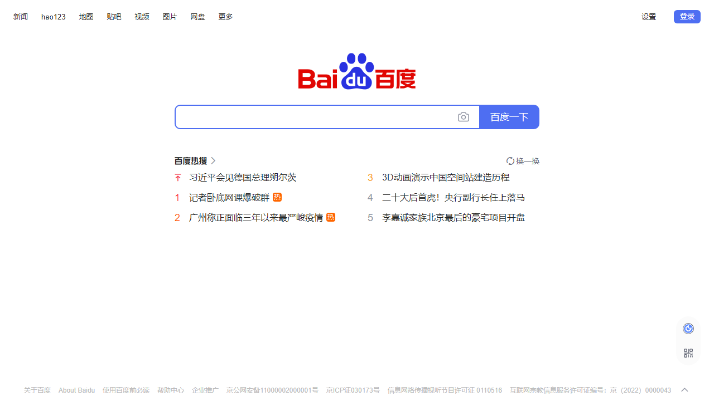

注意，win平台使用playwright时需要关闭fastapi的reload功能

``` py
from pathlib import Path
from ayaka import get_new_page, AyakaApp, MessageSegment

app = AyakaApp("baidu截图")


@app.on_command("baidu")
async def _():
    async with get_new_page() as p:
        await p.goto("http://www.baidu.com", wait_until="networkidle")
        path = Path("test.png").absolute()
        await p.screenshot(path=path)
    image = MessageSegment.image(path)
    await app.send(image)
```



## 下一步

<div align="right">
    在这里~ ↘
</div>
