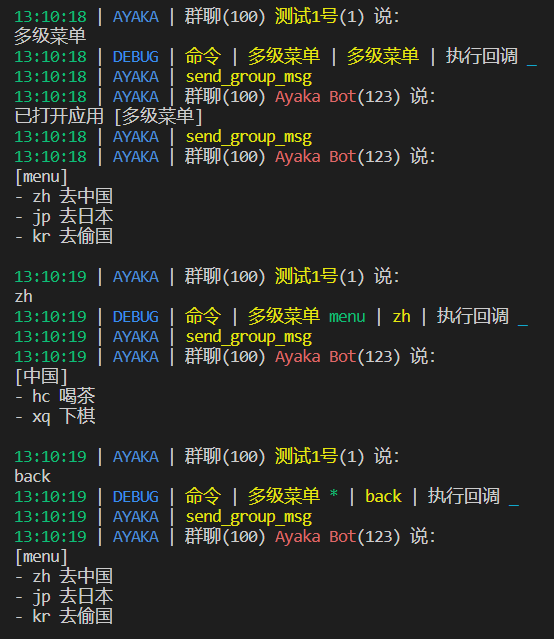
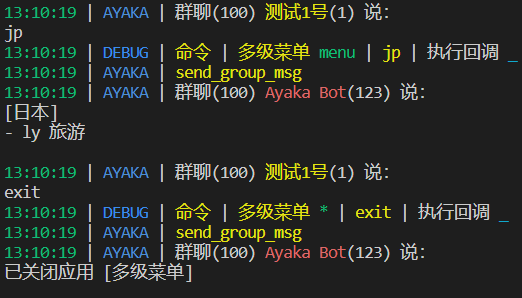

```py
from ayaka import AyakaApp

app = AyakaApp("多级菜单")


@app.on.idle()
@app.on.command("多级菜单")
async def _():
    await app.start("menu")
    await app.send(app.help)


@app.on.state("*")
@app.on.command("退出", "exit", "quit")
async def _():
    await app.close()


@app.on.state("*")
@app.on.command("返回", "back")
async def _():
    app.state = "menu"
    await app.send(app.help)


@app.on.state("menu")
@app.on.command("zh")
async def _():
    '''去中国'''
    app.state = "中国"
    await app.send(app.help)


@app.on.state("menu")
@app.on.command("jp")
async def _():
    '''去日本'''
    app.state = "日本"
    await app.send(app.help)


@app.on.state("menu")
@app.on.command("kr")
async def _():
    '''去偷国'''
    app.state = "偷国"
    await app.send(app.help)


@app.on.state("中国")
@app.on.command("hc")
async def _():
    '''喝茶'''
    await app.send("喝茶")


@app.on.state("中国")
@app.on.command("xq")
async def _():
    '''下棋'''
    await app.send("下棋")


@app.on.state("日本")
@app.on.command("ly")
async def _():
    '''旅游'''
    await app.send("旅游")

```





## 下一步

<div align="right">
    在这里~ ↘
</div>

