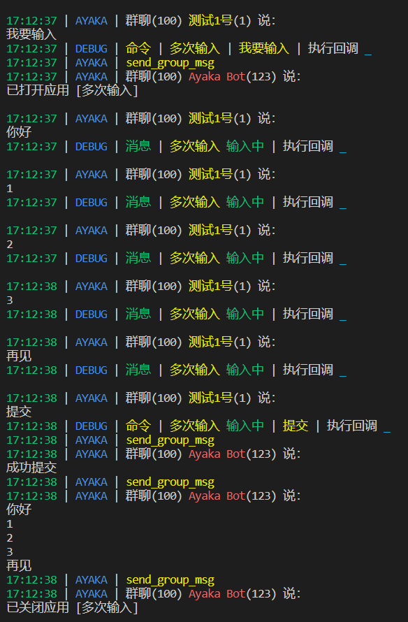

```py
from ayaka import AyakaApp

app = AyakaApp("多次输入")


@app.on.idle()
@app.on.command("我要输入")
async def _():
    '''启动应用'''
    await app.start()
    app.set_state("输入中")
    app.cache.msgs = []


@app.on.state("输入中")
@app.on.text()
async def _():
    '''输入吧'''
    app.cache.msgs.append(app.event.get_plaintext())


@app.on.state("输入中")
@app.on.command("提交")
async def _():
    '''提交信息并关闭应用'''
    msgs = app.cache.msgs
    await app.send("成功提交")
    await app.send("\n".join(msgs))
    await app.close()
```



## 下一步

<div align="right">
    在这里~ ↘
</div>
