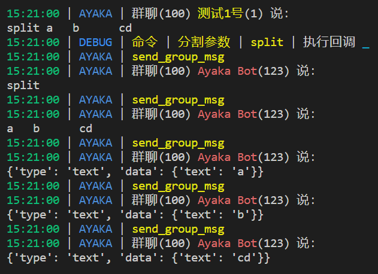

``` py
from ayaka import AyakaApp

app = AyakaApp("分割参数")

@app.on.idle()
@app.on.command("split", "分割")
async def _():
    await app.send(app.cmd)
    await app.send(app.arg)
    for arg in app.args:
        await app.send(arg)
```



## 下一步

<div align="right">
    在这里~ ↘
</div>
